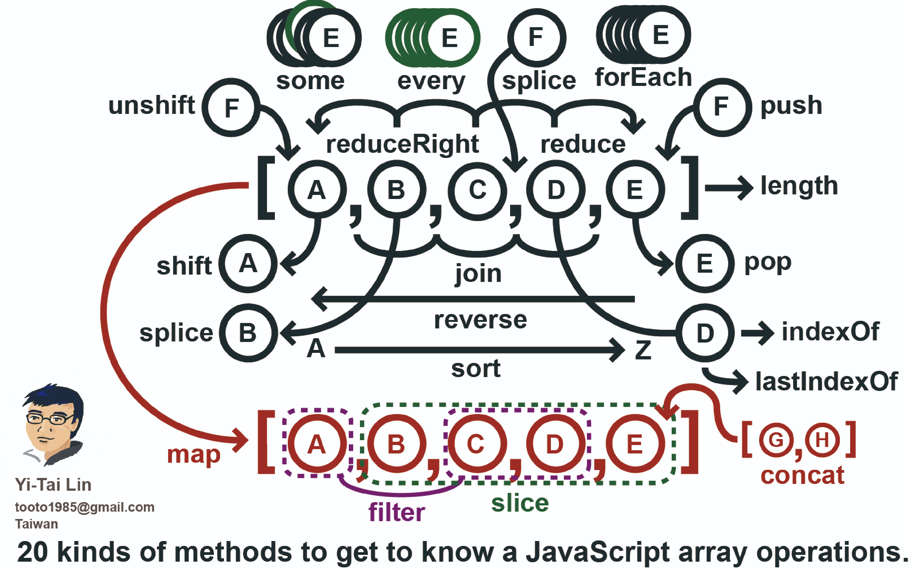

# Immutability
aka Performance and Data Management; a functional programming pattern.

### Immutability in Software Development

In software development, immutability means creating data structures and objects that cannot be changed after their creation. This approach enhances the predictability and reliability of the software.

Immutable Data Structures: Using immutable data structures helps prevent accidental changes and makes concurrent programming easier, as there are no issues with shared state.

Pure Functions: Functions that do not alter the state and return new data instead of modifying existing data lead to more predictable and testable code.

Version Control and Rollbacks: Immutable principles in version control ensure that previous states of the codebase can always be retrieved, promoting stability and reliability.

[immutable.js](https://immutable-js.com/)

- Immutable data cannot be changed once created, leading to much simpler application development, no defensive copying, and enabling advanced memoization and change detection techniques with simple logic. Persistent data presents a mutative API which does not update the data in-place, but instead always yields new updated data.

- Immutable.js provides many Persistent Immutable data structures including: List, Stack, Map, OrderedMap, Set, OrderedSet and Record.

- These data structures are highly efficient on modern JavaScript VMs by using structural sharing via hash maps tries and vector tries as popularized by Clojure and Scala, minimizing the need to copy or cache data.

- Immutable.js also provides a lazy Seq, allowing efficient chaining of collection methods like map and filter without creating intermediate representations. Create some Seq with Range and Repeat.

Optimizing SQL indexing and using Immutable.js involve different aspects of software development but can be related in terms of data management and performance optimization:

1. **SQL Indexing:** In relational database systems like SQL, indexing is used to improve query performance by creating data structures that allow for efficient retrieval of data. Indexes are created on columns in database tables, and they help to speed up data retrieval operations, such as SELECT queries, by providing faster access paths to the data.

[More on Indexing](https://use-the-index-luke.com/)

2. **Immutable.js:** Immutable.js is a JavaScript library that provides immutable data structures for managing state in applications. Immutable data structures cannot be changed after they are created, which helps to prevent unintended side effects and makes it easier to reason about the state of an application, especially in complex applications with shared state.

- **Performance:**
    - SQL indexing optimizes database query performance by providing faster access to data
    - Immutable.js enhances application performance by providing efficient data manipulation and state management.

- **Data Management:**
    - SQL indexing focuses on organizing and accessing data efficiently within a relational database
    - Immutable.js helps manage application state by providing immutable data structures that ensure data consistency and prevent unintended mutations.

While optimizing SQL indexing primarily concerns the backend storage and retrieval of data in a relational database, using Immutable.js typically relates to managing application state in frontend JavaScript applications. However, both concepts contribute to overall performance and data management in software development.

### JS Array Methods

