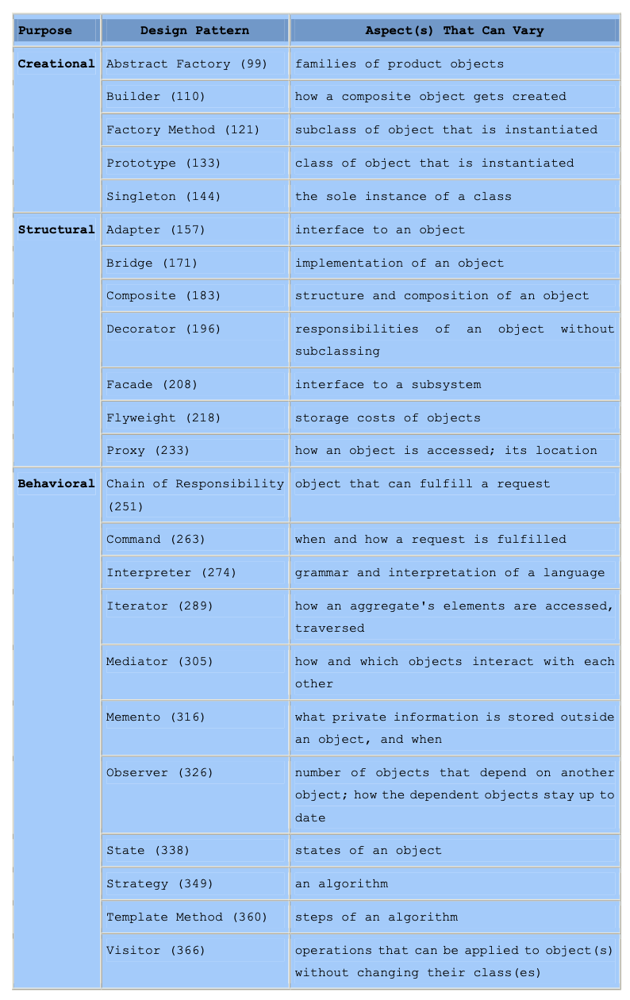
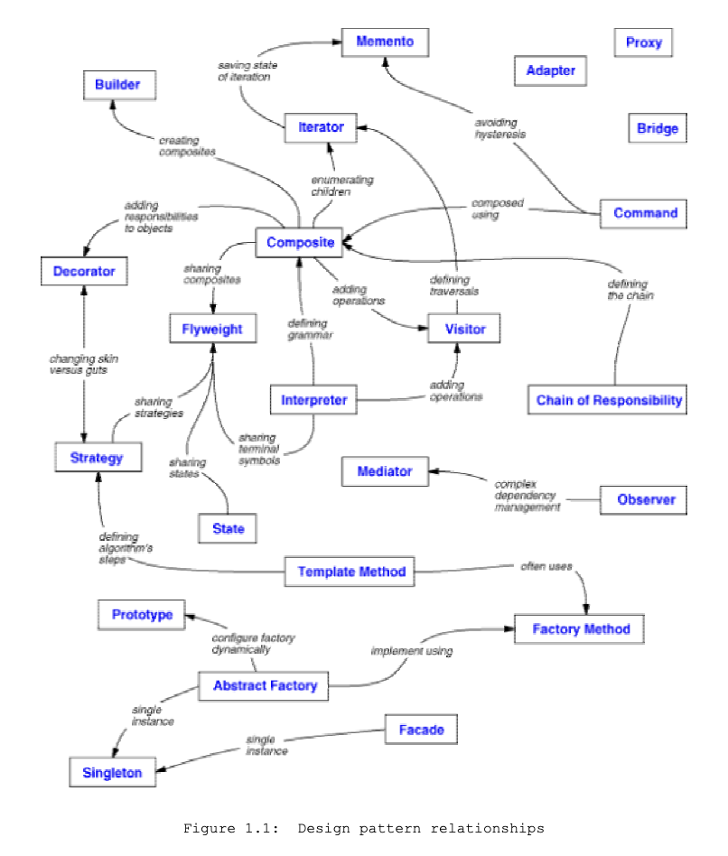

### Design Patterns
Design patterns are typical solutions to common problems in software design. Each pattern is like a blueprint that can be customized to solve a particular design problem in your code.

#### Design Patterns in JS
JavaScript's flexibility allows for the implementation of these patterns in various ways. Here is an example of the Singleton pattern:

```javascript
class Singleton {
    constructor() {
        if (Singleton.instance) {
            return Singleton.instance;
        }
        Singleton.instance = this;
        this.data = "Singleton Data";
    }

    getData() {
        return this.data;
    }
}

const instance1 = new Singleton();
const instance2 = new Singleton();
console.log(instance1 === instance2); // true
```

### Design Patterns


### Design Pattern Relationships


### Types of Design Patterns

#### Behavioral Patterns

1. **Chain of Responsibility**: Handles requests by passing them through a chain of processing objects.
2. **Command**: Encapsulates a request as an object, allowing for parameterization of clients with queues, requests, and operations.
3. **Interpreter**: Defines a representation of a grammar along with an interpreter that uses the representation to interpret sentences in the language.
4. **Iterator**: Provides a way to access the elements of an aggregate object sequentially without exposing its underlying representation.
5. **Mediator**: Defines an object that encapsulates how a set of objects interact, promoting loose coupling by keeping objects from referring to each other explicitly.
6. **Mememto**: Captures and externalizes an object's internal state so that the object can be restored to this state later.
7. **Null Object**: Provides an object as a surrogate for the lack of an object of a given type.
8. **Observer**: Defines a one-to-many dependency between objects so that when one object changes state, all its dependents are notified and updated automatically.
9. **State**: Allows an object to alter its behavior when its internal state changes. The object will appear to change its class.
10. **Strategy**: Defines a family of algorithms, encapsulates each one, and makes them interchangeable. Strategy lets the algorithm vary independently from clients that use it.
11. **Template Method**: Defines the skeleton of an algorithm in the superclass but lets subclasses override specific steps of the algorithm without changing its structure.
12. **Visitor**: Represents an operation to be performed on elements of an object structure. Visitor lets you define a new operation without changing the classes of the elements on which it operates.

#### Creational Patterns

1. **Abstract Factory**: Provides an interface for creating families of related or dependent objects without specifying their concrete classes.
2. **Builder**: Separates the construction of a complex object from its representation, allowing the same construction process to create different representations.
3. **Factory**: Defines an interface for creating an object but lets subclasses alter the type of objects that will be created.
4. **Object Pool**: Reuses and shares objects that are expensive to create.
5. **Prototype**: Specifies the kind of objects to create using a prototypical instance and creates new objects by copying this prototype.
6. **Singleton**: Ensures a class has only one instance and provides a global point of access to that instance.

#### Structural Patterns

1. **Adapter**: Allows objects with incompatible interfaces to collaborate.
2. **Bridge**: Decouples an abstraction from its implementation so that the two can vary independently.
3. **Composite**: Composes objects into tree structures to represent part-whole hierarchies.
4. **Decorator**: Attaches additional responsibilities to an object dynamically, providing a flexible alternative to subclassing for extending functionality.
5. **Facade**: Provides a unified interface to a set of interfaces in a subsystem, defining a higher-level interface that makes the subsystem easier to use.
6. **Flyweight**: Uses sharing to support a large number of fine-grained objects efficiently.
7. **Private Class Data**: Restricts access to constructor functions and prevents modification of instance variables from outside the class.
